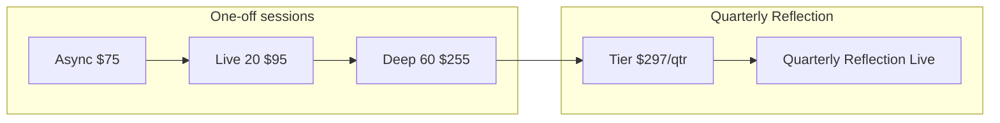
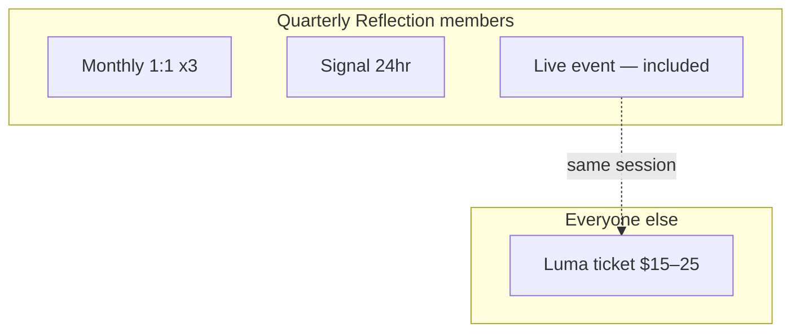

# Quarterly ongoing tier — offer framing and site plan

## Position in your current ladder

Your live site ([`src/data/siteCopy.ts`](src/data/siteCopy.ts), [`src/app/services/page.tsx`](src/app/services/page.tsx)) sells **one-off reflection sessions**:

| Tier | Price | Live time |
|------|-------|-----------|
| Async | $75 | 0 (recorded) |
| Live 20 | $95 | 20 min |
| Deep 60 | $255 | 60 min + optional 20 min follow-up within 30 days |

The new offer fills a gap: **clients who already trust your reflection work and need continuity** between big decisions—not another 60-minute fire drill every time something small comes up.





**Honest value framing (use on the page, not hype):**

- Three **30–45 minute** live calls per quarter ≈ **90–135 minutes** of live reflection time.
- Three Live 20s at $95 = **$285 for 60 minutes** total—shorter calls, no between-session channel.
- One Deep 60 is $255 for a single hour—great for a fork, not for **monthly rhythm + quick second opinions**.
- Intro **$297/quarter** (~**$99/month**) reads as: *slightly more than three Live 20s, but longer calls, Signal access, and a capstone live event included.*
- **Quarterly Reflection Live** (public Luma **$15–25**) gives non-members a taste of the community; members attend **free** as a bundled perk (~$20 value per quarter if they would have bought a ticket).

That math supports the intro price without sounding like a discount gimmick.

---

## Naming brainstorm (no “counsel”)

You are **not a lawyer**—and the product name should not sound like legal or licensed professional advice. Avoid: **counsel, advisory, legal, attorney, retainer** (corporate), **consulting** (implies a firm).

Your existing session names already give you a vocabulary: **Reflection**, **Reading**, **Deep Dive**, **Software Psychic**, **reflection sessions, not rescue** ([`siteCopy.ts`](src/data/siteCopy.ts)).

### Names that fit the brand best (top picks)

| Name | Subtitle idea | Why it works | Watch-out |
|------|----------------|--------------|-----------|
| **Quarterly Reflection** | Monthly 1:1 + Signal second opinions | Matches “reflection sessions”; clearly not legal | Slightly generic |
| **Steady Reflection** | Your quarter of ongoing pattern work | Warm, ND-friendly (“steady” not hustle) | Doesn’t say “quarter” in title |
| **The Reflection Quarter** | Three months of monthly sessions + Signal | Memorable; ties to billing cadence | Longer |
| **Steady Reading** | Monthly live readings + Signal between | Parallels **Live Reading** ($95); one product family | “Reading” needs your existing disclaimer (reflection, not fortune-telling) |
| **Quarterly Reading** | Same | Obvious upgrade path from Live 20 / Deep 60 | Same disclaimer need |
| **Second Opinion Quarter** | Monthly calls + priority Signal | Describes the *between* value literally | Less mystical/brand; very practical |

**Chosen direction (your pick):** **Reflection family** — lead with **Quarterly Reflection** unless you prefer **Steady Reflection** or **The Reflection Quarter** for tone.

**One-liner (name-agnostic):**  
*For neurodivergent business owners who want a steady guide between the big sessions—not emergency rescue.*

**Subtitle (name-agnostic):**  
*Monthly 1:1 reflection + Signal second opinions*

### More options by theme

**Reflection / clarity (safest)**

- **Ongoing Reflection** — simple; could be any cadence
- **Reflection Rhythm** — emphasizes monthly check-in
- **Quarterly Clarity** — ties to “tech clarity” without “session”
- **Pattern Quarter** — emphasizes pattern work from your About copy

**Reading / Pythoness (session family)**

- **Deep Quarter** — plays off Deep 60; “deeper, spread over time”
- **Pythoness Quarter** — brand-native; members feel “in the network”
- **In Your Corner Quarter** — warm; no legal tone
- **The Steady Thread** — narrative; good for newsletter, less scannable on pricing page

**Signal-forward (describes the channel)**

- **Signal & Sessions** — literal; good for people who already use Signal
- **On Signal** — short; might sound like a product launch
- **Priority Signal Quarter** — leads with differentiator; call time feels secondary

**Practical / plain (low mystique)**

- **Monthly Check-In Quarter** — boring but honest
- **Tech Clarity Quarter** — older blog phrase; clear outcome
- **Your Quarter** — nod to Y.O.U. framework; clever double meaning (your quarter / three months)

### Names to skip

- **Quarterly Counsel / Ongoing Counsel** — legal-adjacent (your call)
- **Tech Advisory / Business Advisory** — consultant/legal tone
- **Retainer** — law/firm language
- **Coaching package** — you already steer away from generic “coaching” in some brand docs; “reflection” is sharper
- **Oracle on Demand** — conflicts with “not fortune-telling” positioning

### Copy words to use instead of “counsel”

Use in descriptions and policies: **reflection, second opinion, pattern work, check-in, guide, thought partner, clarity, professional intuitive reflection** (you already use “professional counsel, not fortune-telling” on the site—that’s a *disclaimer*, not the product name; optional later cleanup to “professional reflection, not fortune-telling” for consistency).

### Internal code slug (after you pick a public name)

Use a neutral key in `siteCopy.ts`, e.g. `quarterlyReflection` or `ongoingQuarter`, not `quarterlyCounsel`.

**CTA before Stripe exists:** `Request intake` → mailto subject uses chosen name, e.g. `Quarterly%20Reflection%20intake`.

**Naming decision:** Reflection family — default public name **Quarterly Reflection**; optional variants **Steady Reflection** (warmer) or **The Reflection Quarter** (more memorable). Confirm exact title before implementation (H1 + mailto subject only).

---

## What’s included (customer-facing)

**Each quarter you get:**

1. **Three monthly 1:1 calls** (30–45 minutes, video or voice)  
   - Tarot bookends (same as other live offerings per [`offeringIncludes`](src/data/siteCopy.ts))  
   - One focused thread per call: software, strategy, ops, creative direction  
   - Scheduled within your quarter (you send a private booking link after payment/onboarding)

2. **Priority Signal access**  
   - **Second opinions** and **quick help** between calls  
   - **Response within 24 hours** (define as **business days**, e.g. Mon–Fri; messages after 5pm ET start the next business day)  
   - Encrypted, async-friendly for ND brains who hate inbox ping-pong

3. **Auto-renew quarterly** (copy now; billing later)  
   - Renews every 3 months unless canceled **at least 7 calendar days before** the next billing date  
   - Intro rate honored for active members until you announce a change (see pricing note below)

4. **Quarterly Reflection Live** (end of each quarter)  
   - **Group live session** — same spirit as your existing Luma + YouTube events ([`luma.com/pythoness`](https://luma.com/pythoness) in [`Footer.tsx`](src/components/Footer.tsx))  
   - **Format suggestion:** 60–90 min, Q&A + themed reflection on the quarter (patterns, tools, what stuck)—not 1:1 hot seat for every attendee  
   - **Members:** **Free included** — registration via **private member link** or **Luma promo code** (see ops below)  
   - **Public:** Register on **Luma with paid ticket** — **$15–25** (your pick: e.g. **$20 standard**, or **$15 early bird / $25 day-of** if Luma supports it)  
   - **Active enrollment rule:** Free live access for the quarter you’re **paid and active through the event date** (if you cancel before the live, that quarter’s event access ends unless you bought a public ticket)

**What it is not** (align with existing “not for you” on [`servicesForYouLists`](src/data/siteCopy.ts)):

- Not emergency tech rescue or same-day implementation  
- Not custom web/software development under Pythoness Programmer  
- Not unlimited consulting—Signal is for **reasonable** questions and second opinions, not full project management  
- Not fortune-telling or outcome guarantees  
- **Quarterly Reflection Live** is not a substitute for your three private 1:1s — it’s community reflection, not personal session time  

---

## Quarterly Reflection Live (Luma + members)

### Event naming (public)

- **Title:** **Quarterly Reflection Live** (matches the tier; easy to promote each quarter with a subtitle, e.g. *“Q2 2026 — What your tools tried to teach you”*)  
- **Listing:** On your Pythoness Luma calendar; link from newsletter, [`/services`](src/app/services/page.tsx), and footer Events  
- **Public price:** **$15–25** on Luma (recommend **$20** as default; optional early-bird **$15** if you want urgency)

### Member access (free)

Pick one primary workflow (simplest first):

| Approach | How it works | Pros |
|----------|----------------|------|
| **A. Promo code** | One code per quarter (e.g. `QR-MEMBER-Q22026`) on the **same** paid Luma event → $0 at checkout | One event to manage; public sees real attendance |
| **B. Hidden duplicate event** | Members-only Luma event, free, unlisted link via Signal/email | No code leaks; two events to staff |
| **C. Manual comp** | Members email you; you add as guest in Luma | No tech; doesn’t scale |

**Recommendation:** **A (promo code)** for launch — send code in member onboarding email + Signal pin at quarter start; rotate code each quarter.

**Copy for members:**

> Your quarter includes **Quarterly Reflection Live** at the end of the cycle. I’ll send your private registration link and promo code when the date is set—no extra charge.

**Copy for public (Luma description + site):**

> Join the end-of-quarter **Quarterly Reflection Live**—group reflection on tech, workflow, and creative decisions (Q&A format, neurodivergent-centered). **$20** on Luma. *On the **Quarterly Reflection** tier? This event is included—request intake on the services page.*

### Your quarterly rhythm (operator checklist)

1. **Week 10–11 of quarter:** Set date; create Luma event (paid ticket + member promo).  
2. **Announce:** Newsletter + optional site banner linking `NEXT_PUBLIC_LUMA_QUARTERLY_LIVE` (env in [`booking.ts`](src/config/booking.ts), updated each quarter).  
3. **Members:** Send promo + reminder on Signal 1 week and 1 day before.  
4. **Day of:** YouTube (or Zoom) stream as you do today; Luma for registration/reminders.  
5. **After:** No recording promise unless you choose to—state on Luma if recordings are not shared.

### Site / config additions (with tier launch)

- `quarterlyReflection.liveEvent` in `siteCopy.ts`: title, short description, public price line, member-included line, link to Luma calendar or current event URL  
- `booking.ts`: `lumaHub` (existing footer URL) + optional `quarterlyReflectionLive` env for the **current** event slug  
- Services page: one bullet under tier features + optional small “Community” callout linking public Luma listing  
- Terms: live event is educational/group format; ticket refunds follow Luma/your stated policy; member promo is non-transferable

---

## Introduction pricing language

Display price as **quarterly first** (avoids “$99/mo subscription” confusion when you bill every 3 months):

> **$297 per quarter**  
> *Introduction pricing — about $99/month when you spread it across the quarter.*

Optional footnote:

> *Billed as one payment every three months. Auto-renews unless you cancel before your renewal date.*

**Post-intro standard price (decide before launch; placeholder for site):** e.g. **$347/quarter** or **$397/quarter**—only mention on site if you want transparency; otherwise “intro rate locked while you stay enrolled” without publishing the future number yet.

**Eligibility (your choice: open with intake):**

> *Anyone can apply. Start with a short intake so we can confirm this tier fits your needs better than a one-off session.*

Intake questions (email or form—3–5 fields):

- What are you building/running?  
- What would you use the monthly call for?  
- What would you use Signal for between calls?  
- Have you worked with Amanda before? (optional)  
- Time zone + preferred call format (video/voice)

---

## Draft sales copy (ready for `siteCopy.ts`)

*Use **Quarterly Reflection** unless you switch to a variant below.*

**Hero blurb (services section):**

> **Quarterly Reflection** — $297/quarter (intro)  
> Monthly 1:1 reflection for software, strategy, and creative decisions—plus Signal for second opinions when you’re stuck between calls—and **Quarterly Reflection Live** at the end of your quarter, included. Built for brains that need continuity, not another one-off deep dive every time a tool question pops up.

**Feature bullets:**

- Three 30–45 minute live sessions per quarter (video or voice)  
- Tarot bookends on live calls—reflection, not rescue  
- Priority replies on Signal within one business day  
- **Quarterly Reflection Live** at quarter’s end — **free for members** (public tickets **$15–25** on Luma)  
- Auto-renews quarterly; cancel anytime before your next renewal date  

**Best for:**

- You’re implementing changes from past sessions and want a monthly check-in  
- You want a human second opinion before you buy, automate, or rip out a tool  
- You process better with a steady relationship than booking cold each time  

**Not for:**

- One-off decisions (use Live 20 or Deep 60)  
- “Just fix it for me” or hands-on implementation  
- Unlimited messaging or weekend emergency support  

**Compare to Deep 60 (one sentence on page):**

> *Deep 60 is for a major fork in one sitting. Quarterly Reflection is for the quarter when the work keeps showing up.*

---

## Site implementation (no payment yet)

You chose **copy + site** without Stripe subscription setup. Minimal, consistent changes:

### 1. Central copy — [`src/data/siteCopy.ts`](src/data/siteCopy.ts)

- Add `quarterlyReflection` object (mirror `SessionCopy` shape: title, subtitle, price, description, features, note, ctaText).
- Add `quarterlyReflectionLive` blurb (event title, member-free line, public Luma price, link).
- Add `quarterlyOngoingPolicies` (Signal scope, 24hr definition, scheduling, cancel/renew, live event eligibility, non-transferable promo).
- Optionally extend `sessionComparison` with a **second table** `ongoingComparison` (don’t squeeze a 4th column into the existing 3-session table—mobile layout is already tight per [`SessionComparison.tsx`](src/components/SessionComparison.tsx)).

### 2. Services page — [`src/app/services/page.tsx`](src/app/services/page.tsx)

- New section **after** the three session cards, **before** “What makes this different”: visually distinct (e.g. ring/highlight like async’s `highlight`).
- `ServiceCard` with `ctaLink` = intake mailto (or form URL).
- Add policy subsection under existing `policies` or a dedicated ongoing-tier policies block.

### 3. Homepage MDX (optional but consistent) — [`content/home/services.mdx`](content/home/services.mdx)

- Add under `additionalServices` **or** a third “tier” block if homepage still consumes this file (verify what renders on `/` vs `/services`—primary UX is `/services` via `page.tsx`).

### 4. Booking config placeholder — [`src/config/booking.ts`](src/config/booking.ts)

```ts
quarterlyIntake: process.env.NEXT_PUBLIC_BOOKING_QUARTERLY_INTAKE ?? 'mailto:help@...subject=Quarterly%20Reflection%20intake'
lumaHub: process.env.NEXT_PUBLIC_LUMA_HUB ?? 'https://luma.com/pythoness'
quarterlyReflectionLive: process.env.NEXT_PUBLIC_LUMA_QUARTERLY_LIVE ?? 'https://luma.com/pythoness' // swap each quarter
```

### 5. Voice guide sync — [`src/docs/Site Copy & Voice Guide.md`](src/docs/Site Copy & Voice Guide.md)

- Add row to service table and 1 paragraph on tier ladder.

### 6. Terms (light touch, no full legal rewrite)

- [`content/legal/terms-of-service.mdx`](content/legal/terms-of-service.mdx): one bullet under Payment Terms for the quarterly ongoing tier (billing cycle, auto-renew, cancel window, Signal fair use). Full Stripe subscription terms can wait until billing exists.

### 7. Search/metadata

- [`src/lib/site-search-static-pages.ts`](src/lib/site-search-static-pages.ts): keywords from chosen name + `quarterly reflection`, `ongoing`, `Signal`, `second opinion` (avoid `counsel`, `retainer` unless you want SEO for those queries).

**Defer until a later phase:** Stripe Billing subscription product, webhook handling in [`src/app/api/store/webhook/route.ts`](src/app/api/store/webhook/route.ts), dedicated Zoom recurring event type, Signal onboarding SOP.

---

## Operational boundaries (put in policies on site + intake email)

| Topic | Recommendation |
|--------|----------------|
| Signal volume | “A few focused messages per week is normal; if we need a call, we’ll say so.” |
| 24-hour SLA | Business days; not holidays; not “drop everything” |
| Call scheduling | Book within the quarter; **no rollover** of unused months unless you choose grace (default: no rollover keeps scope clear) |
| Scope creep | Implementation, debugging your prod app, or vendor negotiations on your behalf → book Deep 60 or decline |
| Privacy | Signal is E2E; still no sensitive credentials in chat |
| Renewal | Auto-renew quarterly; cancel 7+ days before charge |
| Intro price | Locked for continuous enrollment until you give 30 days’ notice of change |
| Live event | Members active through event date get free access; promo non-transferable; public pays on Luma |
| Live vs 1:1 | Group Q&A only on live event—not private reading time for every attendee |

---

## Launch sequence (after plan approval)

1. Finalize **post-intro price** (private decision; optional public mention).  
2. Paste draft copy into `siteCopy.ts` and wire services page section + policies.  
3. Add intake mailto/form link in `booking.ts`.  
4. Quick pass: voice checklist in [`BLOG_VOICE_GUIDE.md`](BLOG_VOICE_GUIDE.md) (no AI filler; coaching not dev services).  
5. Smoke-test `/services` layout on mobile (new section + comparison table).  
6. Create first **Quarterly Reflection Live** on Luma (public **$20** ticket + member promo code workflow).  
7. **Later:** Stripe quarterly product + customer portal for cancel; private Zoom link for members only.

---

## Open decisions (before implementation)

1. **Product name** — **Quarterly Reflection** (reflection family); confirm vs **Steady Reflection** / **The Reflection Quarter**.
2. **Post-intro quarterly price** — e.g. $347 or $397; does not block site copy if you only promise “intro rate while enrolled.”
3. **Luma public ticket** — **$15–25** range locked; pick single price (**$20** recommended) or early-bird tier on first event.
4. **Member access method** — promo code (recommended) vs hidden free event.
