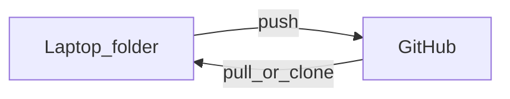
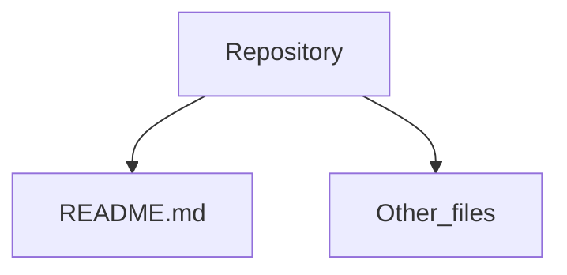
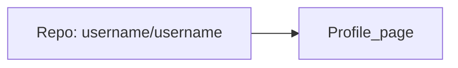
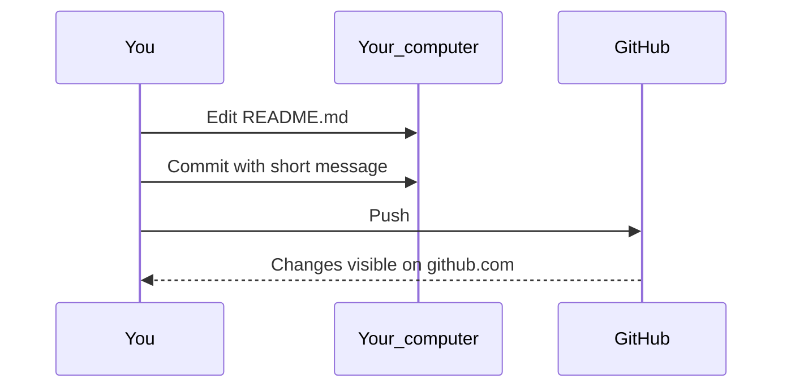

---

GitHub is a home for folders that can travel. You edit files on your computer (or in the browser), save a snapshot with a short note, and send that snapshot to GitHub so the same folder is available from anywhere.

This post uses **plain language and diagrams**. You do not need the terminal. Your first project is small and public-friendly: a **profile README**—the text that appears at the top of your GitHub profile page.

---

## Create a GitHub account

1. Go to [github.com](https://github.com) and sign up.
2. Pick a **username** you are happy to keep. It becomes part of your profile URL (`github.com/your-username`) and, in the next project, the name of a special repository.

---

## Vocabulary (five words)

| Word | Plain meaning |
|------|----------------|
| **Repository** | A project folder on GitHub, with its files and history |
| **README** | A Markdown file GitHub shows when someone opens the repo (often the first file they read) |
| **`main`** | The default branch—the copy of the project you treat as "current" |
| **Commit** | A saved snapshot of your changes, with a short message describing what you did |
| **Push** | Send your commits from your computer (or the website) up to GitHub |

### Your folder and GitHub stay in sync



### Inside a repository



---

## Teaching project: your profile README

GitHub can show a **README on your profile page** (not inside a code project). You get that by creating a repository with a specific name.

### What makes it special

- Repository name must be **exactly the same as your username**.
- Full name looks like: `your-username/your-username` (for example `devandapaige/devandapaige`).
- The `README.md` file in that repo renders on `https://github.com/your-username`.



### Steps in the browser

1. Sign in to GitHub.
2. Click **+** (top right) → **New repository**.
3. **Owner:** your account.
4. **Repository name:** type your username exactly (GitHub may show a hint that this is a special profile repository).
5. **Public** is fine for this learning project.
6. Check **Add a README file**.
7. Click **Create repository**.
8. On the new repo page, click the **pencil** to edit `README.md`.
9. Replace the default text with something true about you. Starter you can paste and edit:

```markdown
# Hi, I'm Alex

I'm learning to use GitHub as a home for my notes and templates—not just for code.

- Currently: IDE workbench + plain-text rhythms
- Learning: commit and push without the terminal
- Add your site or newsletter link when ready
```

10. Scroll down, write a short **Commit message** (for example `add profile intro`), and click **Commit changes**.

That click is your **first commit**: a named snapshot of the file.

11. Open `https://github.com/YOUR-USERNAME` in a new tab. Your README should appear on your profile.

---

## How commit and push work (one habit)



Every time you change files in a repo, the loop is the same:

1. **Edit** a file.
2. **Commit** with a plain-English summary (what changed, not jargon).
3. **Push** so GitHub has the latest copy.

On the website, steps 2 and 3 are often one screen ("Commit changes"). In [GitHub Desktop](https://desktop.github.com/), you type a summary, click **Commit to main**, then **Push origin**.

---

## Same habits with GitHub Desktop (optional)

GitHub Desktop is a free app that shows your changed files and buttons for commit and push—useful when you work in an editor like VS Code or [Cursor](https://cursor.com/referral?code=HE5B2LBMDM7G).

1. Install from [desktop.github.com](https://desktop.github.com/) and sign in.
2. **File → Clone repository** → choose your `username/username` profile repo (or any repo you own).
3. Open the folder in your editor, edit `README.md`, save.
4. In GitHub Desktop: review the diff → write a **Summary** → **Commit to main** → **Push origin**.

---

## Fork and private repositories (short)

**Fork** — On someone else's public repo, **Fork** creates **your copy** on your account. Clone **your** fork so you can push without needing permission on the original template.

**Private** — Only you (and people you invite) can see the repo. Use a **private** repository when files hold real client material, health information, or anything you would not post publicly.

When you are ready for a practice workbench with sample files:

1. Open [github.com/devandapaige/ide-workbench-starter](https://github.com/devandapaige/ide-workbench-starter).
2. Click **Fork** (top right).
3. Clone **your fork** with GitHub Desktop, then follow [From Files to Playbook](https://www.pythonessprogrammer.com/blog/from-files-to-playbook).

---

## What to do next

| If you want to… | Go here |
|-----------------|--------|
| Clone a sample IDE folder and use Cursor with AI | [From Files to Playbook](https://www.pythonessprogrammer.com/blog/from-files-to-playbook) + [ide-workbench-starter](https://github.com/devandapaige/ide-workbench-starter) |
| Watch the clone-and-push walkthrough | [Pythoness Programmer on YouTube](https://www.youtube.com/@pythonessprogrammer) |
| Learn the IDE layout first | [Your IDE Is a Workbench](https://www.pythonessprogrammer.com/blog/your-ide-is-workbench) |

---

*[Your IDE Is a Workbench](https://www.pythonessprogrammer.com/blog/your-ide-is-workbench) · [From Files to Playbook](https://www.pythonessprogrammer.com/blog/from-files-to-playbook) · [Starter repository](https://github.com/devandapaige/ide-workbench-starter)*
